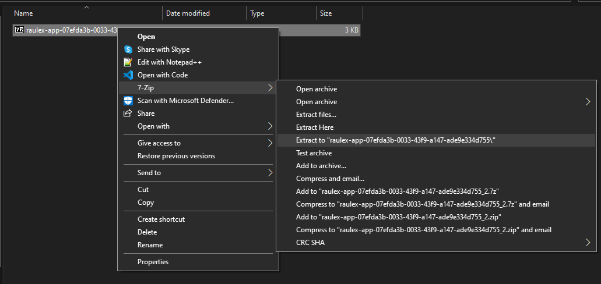

# 🔧 Modifying Configs

### 🎉 Introduction

All the mod **configurations** are **stored** in **Raulex servers**, you will **not find** your **configuration** in your **profiles** folder of your server unlike normal mods out there.

### Adding/Removing a door

Goto your **Item Spawn Menu** and search for <mark style="color:orange;">RaulexKeyCardRoomsConverter</mark>. You can use this tool on **any openable door** in DayZ, also any **custom openable doors** from any **external**/**workshop mods**.

Once you have **used the tool** on a door, it will be **automatically added** to your **application config**.&#x20;

## Method 1 : Using your console in our discord.

#### **Step 1 :** Download your Application config.

<figure><figcaption>
<strong>.zip</strong> file with app configs
</figcaption></figure>

#### Step 2: Unzip the configs and make changes you require

<figure><figcaption>
Use any program of your choice to extract the .zip file.
</figcaption></figure>

#### Step 3: Open the extracted files and make any changes that you require.

#### Step 4: Zip the file back.&#x20;


Make sure you **select all the folders** inside the extracted folder before zipping. Currently we  **support** only the following **file extensions:**\
**.zip**


<figure><figcaption>
Select all folders (<mark style="color:yellow;">keycard-rooms, raulex-core, ...</mark>)  before zipping the files.
</figcaption></figure>

#### Step 4: Drag and drop the zipped file onto your discord panel.

<figure><figcaption>
Zip file is <strong>drag and dropped</strong> into your <strong>console thread</strong>.
</figcaption></figure>

#### **Step 5: Proceed to validate and update your configs.**

&#x20;If you have **zipped** your file **correctly**, you will get a **prompt** to let you **validate** and **update** your **application** with the config file you have **dropped** in the **console**.

Proceed by clicking [Validate](../../user/readme/config-validator.md) and <mark style="color:red;">🚀Go and</mark> ✅ <mark style="color:green;">Confirm</mark>.

<figure><figcaption>
Prompt to validate your config.
</figcaption></figure>

<figure><figcaption></figcaption></figure>

<figure><figcaption>
Success response.
</figcaption></figure>

#### Step 6: Restart your server.

After you have pushed your update, **restart your server** and the configuration will be **reflected** on your **server**.
